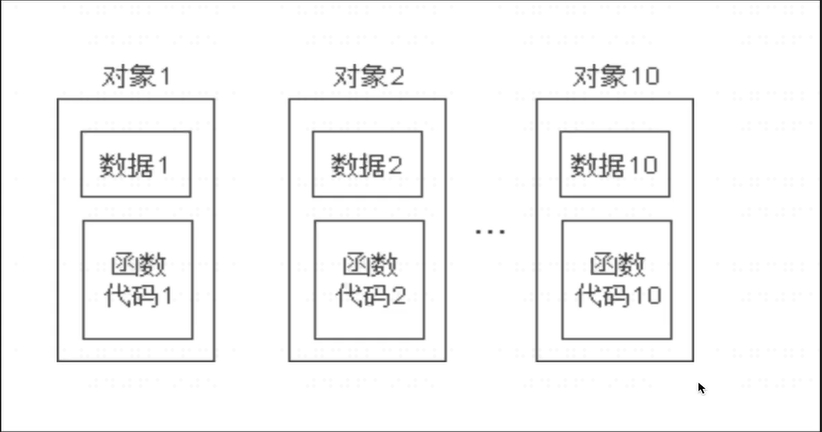
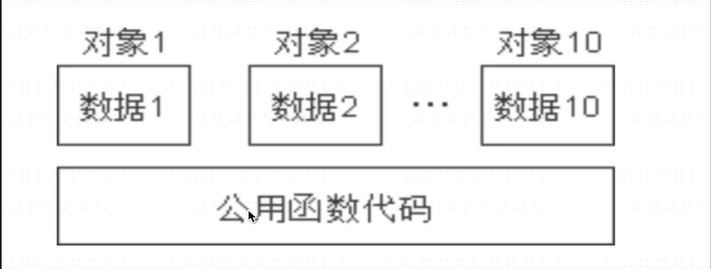
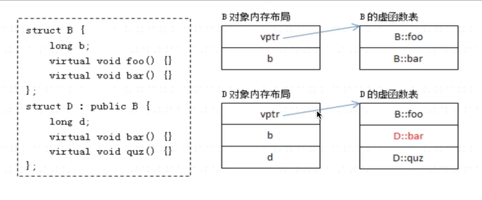
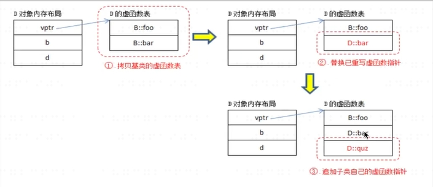
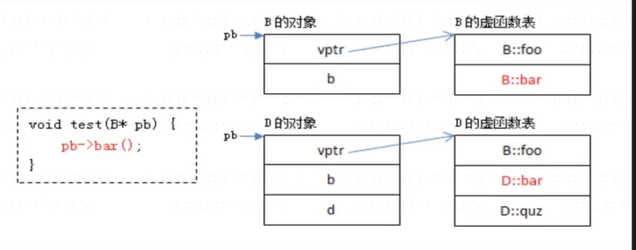

## 想象的对象内存结构:
 
计算机中每一个类要有属于自己的变量，两个类对应对象中变量可能不同，对于函数来说，可以公用，没有严格意义一定属于哪个对象。 
## 实际的对象内存结构：

## 对象内存的布局：
 
类创建内存，如果有虚函数，第一个位置一定是虚函数的指针，指向一张虚函数表 
当有继承发生的时候，变量和函数继承，有重复的函数，看D的虚函数表怎么构建，用自己的虚函数把重名的函数重新构建 
把父类的虚函数拿过来，覆盖重名的函数，接着追加自己的函数 
## 对象内存中虚函数表的构造过程：

## 对象中虚函数的调用过程：
 
传入父类指针，包含父类或子类对象。如果传入的是父类的指针就只想B的位置，如果是子类的指针就是D的位置。编译的时候程序不知道调用的是哪个对象，运行期的时候会知道拿到的是哪个指针。发现是父类或子类的指针，调用对应的虚函数。
